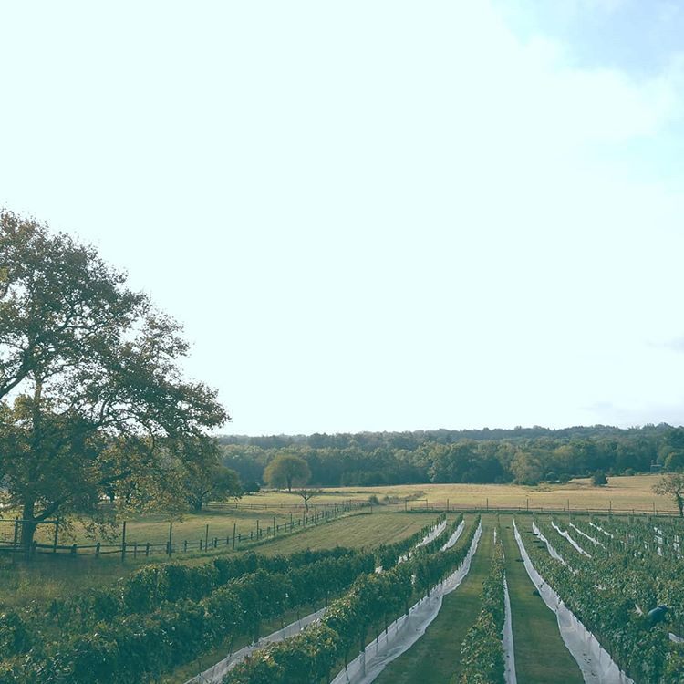

* ## Venue ##

   

   

   Unionville Vineyards  
   9 Rocktown Rd  
   Ringoes, NJ 08551

   <iframe src="https://www.google.com/maps/embed?pb=!1m18!1m12!1m3!1d3037.2732528233623!2d-74.83088708491731!3d40.42494786306407!2m3!1f0!2f0!3f0!3m2!1i1024!2i768!4f13.1!3m3!1m2!1s0x89c3fa6333bc983d%3A0xd030d693ef035670!2sUnionville%20Vineyards!5e0!3m2!1sen!2sus!4v1575402373644!5m2!1sen!2sus" width="100%" height="400" frameborder="0" allowfullscreen=""></iframe>
   

   

   

   > In the heart of America’s Colonial Crescent, Unionville Vineyards offers breathtaking natural beauty, bountiful terroir, historic significance and award-winning artisanal wines.

   [Website](https://unionvillevineyards.com/)
   

   

* ## Hotel ##

   ### Hotel Name ###
   123 Main St.   
   Town-Name, NJ 12345   
   123-456-7890

   We have a block of discounted rooms reserved under the code on your invitation.

* ## Airport ##

   ### Newark Liberty International Airport ###

   This is the best place to fly into.

   Using the __AirTrain__ at the airport, go to the __Newark Airport train station__.

* ## Train ##

   ### NJ Transit ###

   Take a southbound __Northeast Corridor (NEC)__ train to the __Princeton Junction Station__. This train can be picked up at both __New York Penn Station__ and __Newark Airport train station__.
